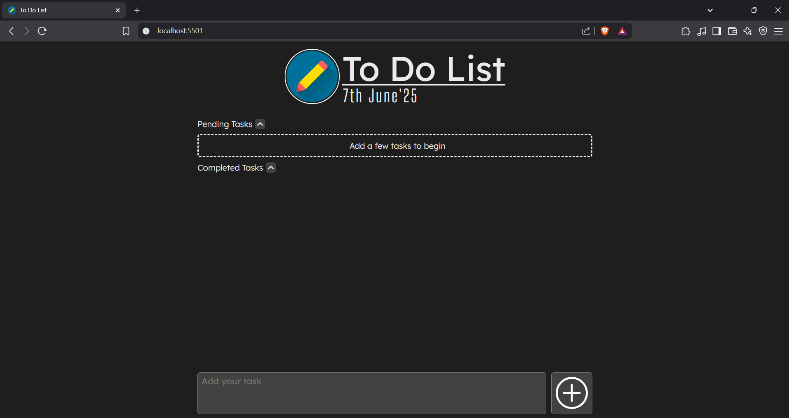
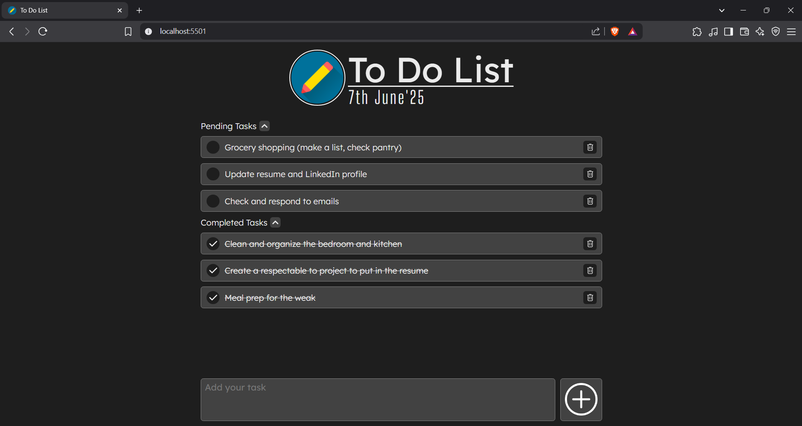

# To-Do List

A simple and intuitive To-Do List web application built using vanilla **HTML**, **CSS**, and **JavaScript**. This project allows users to manage their daily tasks efficiently by adding, completing, and deleting tasks in a clean, minimalist and responsive interface.

## Features

- **Add Tasks**: Quickly add new tasks using an input field.
- **Mark as Complete**: Click on a task to mark it as completed or incomplete.
- **Delete Tasks**: Remove tasks from your list when they're done.
- **Persistent Storage**: Tasks are saved in your browser's local storage, so your list is preserved even after refreshing the page.
- **Responsive Design**: Works perfectly on both desktop and mobile devices.

## Website Demo

 

 


## Getting Started

### Prerequisites

- A modern web browser (Chrome, Firefox, Edge, Safari, etc.)

### Running Locally

1. **Clone the repository:**

   ```bash
   git clone https://github.com/DevTushit17/to-do-list.git
   ```
2. **Navigate to the project directory:**

   ```bash
   cd to-do-list
   ```
3. **Open `index.html` in your browser:**
   - You can double-click on the `index.html` file to use it.
   - Alternaively, you can use the [Live Server](https://marketplace.visualstudio.com/items?itemName=ritwickdey.LiveServer) extension for Visual Studio Code to run it on a server.

## Project Structure

```
to-do-list/
|── README.md
|── assets/          #All the images used in the project
|── css/             #CSS files
| └── main_style.css
|── js/              #JavaScript files
| └── main_script.js
|── index.html
```

## Customization

- You can change the styles in `main_style.css` to personalize the look and feel.
- To add more features (such as due dates, categories, etc.), feel free to edit `main_script.js` and expand the functionality.

## Contributing

Contributions are welcome! If you have ideas for improvements or spot any bugs, feel free to open an issue or submit a pull request.

## License

This project is licensed under the MIT License.

---

**Happy task managing!**